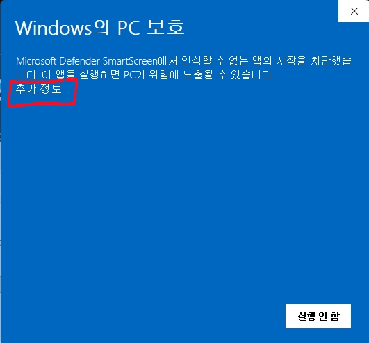

# TuFlauncher

TuF 클랜 ELO 시스템 연동 런처입니다.  
스타크래프트 리마스터 리플레이를 자동 감지해 전적을 Google Sheets에 기록합니다.
- 해당 런처 파일의 기능은 리플레이 폴더 탐색기능 하나만 존재합니다. 
- 어떠한 개인정보 수집도 다른 기능도 존재하지 않습니다.

---

## 설치 방법

### 1. 다운로드

[다운로드](https://github.com/asd3656/TuFELO_Launcher/releases/latest)에서 **`TuFlauncher.exe` 파일 하나만** 받으면 됩니다.

### 2. 폴더 구조 확인

```
원하는 폴더\
└── TuFlauncher.exe
└── TuFconfig.json         // <-- 첫실행 후  자동 생성
```

- `TuFconfig.json`은 첫 실행 시 같은 폴더에 자동으로 생성됩니다.
- 해당 파일은 프로그램의 설정값을 저장하는 파일로 TuFlauncher.exe 파일과 같은폴더에 넣어놓으시면 됩니다. (없을 시 자동생성 걱정x)

---

## 사용 방법

1. **`TuFlauncher.exe`** 를 실행합니다.
2. **닉네임** 본인 닉네임을 입력합니다.
3. **리플레이 폴더** 경로를 확인합니다.  
   기본값: `내 문서\StarCraft\Maps\Replays`
4. **설정 저장** 버튼을 눌러 저장합니다.
5. **런처 시작** 버튼을 누릅니다. (이후 프로그램 시작 시 자동 on입니다.)
6. 스타크래프트에서 게임을 마치면 자동으로 전적이 기록됩니다.

---

## 전적 기록 조건

다음 조건이 모두 충족되어야 자동으로 기록됩니다.

- **방 제목에 `$친선` 또는 `$내전` 등 `$` 태그가 포함되어 있어야 합니다.**'$'가 들어간 제목의 게임은 모두 기록됩니다. '$' 뒤에 붙은 단어로 경기유형이 적용됩니다.(ex. 방제목 : ㅁㄴㅇㄹ$친선 일경우 게임종료 후 친선경기로 시트에 전송, 방제목: 테스트$팀매배 일경우 팀매배로 시트에 전송)
- 1v1 게임이어야 합니다.(밀리, 탑바텀 모두 가능)
- 런처를 실행한 본인이 옵저버여도 자동기록 가능합니다.
- 인게임 닉네임이 중요합니다. 런처에 설정한 본인의 닉네임이 아닐 시 옵저버 인것으로 판정합니다. 상대방의 닉네임도 중요합니다.(대소문자 무시)
- **닉네임 판별 로직은 두가지입니다. 정확한일치 -> `(백틱)` 또는 [](대괄호) 뒤 닉네임비교 순으로 우선순위가 책정됩니다. 예를들어 Tyr, TuF`Tyr, [ASD]tyr 모두 Tyr로 인식합니다. **
- Tyran, tyr`tuf, ASD]tyr 모두 미확인 상대로 인식합니다. 미확인 상대로 인식 할 시 사용자 본인이 런처에서 상대방 닉네임을 지정합니다.
- 게임을 시작한 뒤 바로 나가 draw 처리된다면 전송되지 않습니다.
- 런처에 다른사람 닉네임을 입력하면 해당 닉네임으로 전송됩니다. 주의바랍니다.
- 옵저버 본인만 런처 켜도 됩니다. 게임참여자 1 또는 2가 클랜원 닉네임으로 인식 안될경우 런처에서 수동입력 후 전송해야합니다.

---

## 버튼 설명

| 버튼 | 설명 |
|------|------|
| 설정 저장 | 현재 닉네임·폴더 설정을 저장 |
| ELO보드 | ELO 순위 사이트 열기 |
| 승부예측 | 승부예측 사이트 열기 |
| 전적시트 | Google Sheets 전적 시트 열기 |
| 런처 시작 / 중지 | 리플레이 자동 감지 시작·중지 |
| 열기 | 리플레이 폴더 열기 |
| A- / A+ | 로그 글씨 크기 조절 |
| 지우기 | 로그 창 내용 지우기 |
| 공지 | 로그 창에 공지내용 보기 |
| 미확인 상대 | 상대방 닉네임 클랜원으로 판별 불가 시 사용자 수동입력 |

---

## 설치 불가 // 보안 경고

- 설치 불가 시 브라우저의 보안탭을 확인하시기 바랍니다.
- 브라우저마다 보안 디폴트값이 다릅니다.
- 다운로드 브라우저가 본인이 기존에 쓰던 브라우저인지 확인해주세요.
- 실행 시 아래와 같은 경고창이 뜰 수 있습니다.



**"추가 정보"** 를 클릭하면 **"실행"** 버튼이 나타납니다.

---

## 몰라도 되는 TMI

- 런처로 전송한 데이터는 시트의 H열(경기유형)기준 빈칸 제일 위에 입력된다.
- 런처의 중복방지 로직은 L열의 리플레이 번호(해시)로 구분한다.


---

## 문의

Tyr에게 개인톡 또는 ELO BOARD 사이트 건의게시판 문의해주세요.
